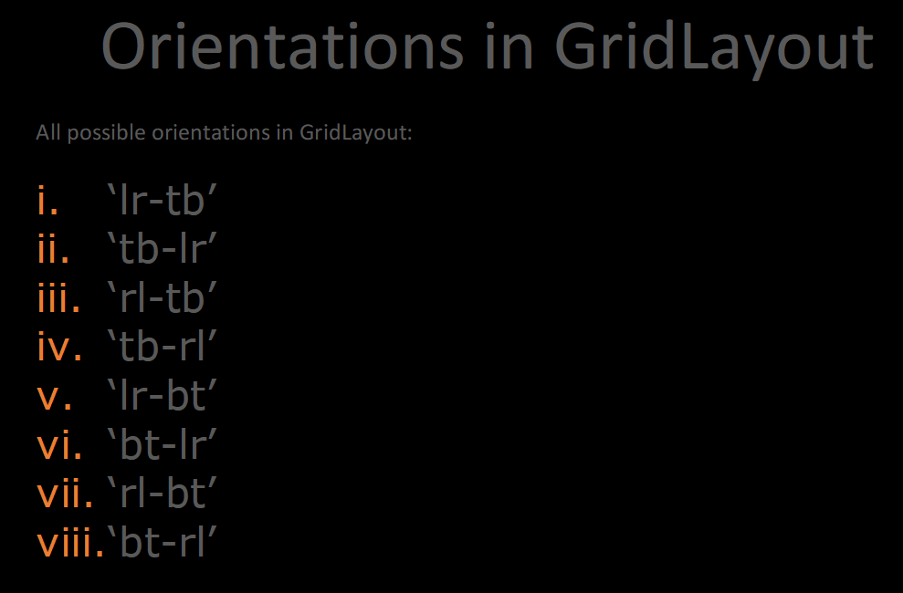

# BOXLAYOUT


# GRIDLAYOUT
A classe GridLayout organiza seus filhos como sendo uma matriz. Pega-se o espaço 
disponível e divide-o em linha e colunas, então os Widget são adicionados às células 
resultantes.

Para fazer a importação da classe gridlayou

```commandline
from kivy.app import App
from kivy.uix.gridlayout import GridLayout
```

Largura da coluna e Altura da linha
A altura/largura da coluna é determinada em 3 passos:
• O tamanho inicial é determinado pelas propriedades `col_default_width` e 
`row_default_height`. Para personalizar a tamanho de uma única célula ou linha, 
utilize cols_minimumou rows_minimum.
• O `size_hint_x/size_hint_y` dos filhos é considerado. Se não estiver definido uma 
“dica” do tamanho (size_hint), o tamanho máximo será usado por todos os fi- lhos.
• É possível forçar o tamanho padrão pela configuração das propriedades 
col_force_default ou row_force_default. Isso forçará o layout a igno- rar
as propriedades width e size_hint dos filhos e utilizará o tamanho padrão.


